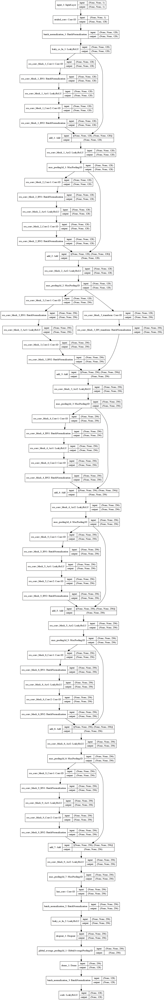

Using the adaptation of Howdy @boltgolt 

The project is currently in development.

# Speaker Authentication for Linux 

Speaker Authentication for Linux provides Speaker-Voice authentication for Linux. Use microphone in combination with Speaker Verification and Identification (Deep Learning) to prove who you are. 

Using the central authentication system (PAM), this works everywhere you would otherwise need your password: Login, lock screen, sudo, su, etc.

# Installation 

```sh 
 $ git clone https://github.com/jiapulidoar/SpeakerAuthentication.git
 $ cd FuturePresentation
```

# CLI

The installer adds a cli command to manage face models for the current user. Use cli --help  to list the available options.

Usage:

```sh 
cli.py [-U user] [-y] command [argument] 
```

| Command   | Description                                   |
|-----------|-----------------------------------------------|
| `add`     | Add a new speaker model for an user           |
| `clear`   | Remove all speaker models for an user            |
| `list`    | List all saved speaker models for an user        |
| `remove`  | Remove a specific model for an user           |
| `test`    | Test the microphone and recognition methods       |


## Model 

